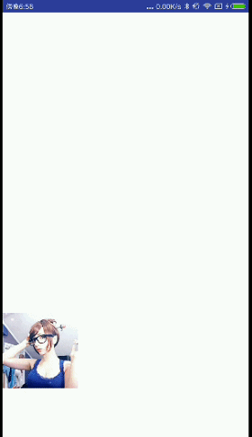

# PrismSE
Prism SharedElement support OS on API 11 and above.

## Using TabView in your Application
If you are building with Gradle, simply add the following line to the dependencies section of your build.gradle file:
````groovy
compile 'com.github.looa:SharedElement:-SNAPSHOT'
````
Add it in your root build.gradle at the end of repositories:
````groovy
allprojects {
	repositories {
		...
		maven { url 'https://jitpack.io' }
	}
}
````
## Sample


Java StartActivity.java
````groovy
adapter.setOnItemClickListener(new SimpleAdapter.OnItemClickListener() {
     @Override
     public void onItemClick(View view, int position) {
          Intent intent = new Intent();
          intent.setClass(MainActivity.this, SubActivity.class);
          PrismSE.getInstant().startActivity(view, intent, true);
     }
});
````
or
````groovy
adapter.setOnItemClickListener(new SimpleAdapter.OnItemClickListener() {
     @Override
     public void onItemClick(View view, int position) {
          Intent intent = new Intent();
          intent.setClass(MainActivity.this, SubActivity.class);
          PrismSE.getInstant().initSharedElement(view, intent, true);
          //you can use your method to start activity
          //maybe you have used url to open the next page.
          //instead of startActivity if you need.
          startActivity(intent);
          overridePendingTransition(0, 0);
     }
});
````
and TargetActivity.java
````groovy
@Override
protected void onCreate(Bundle savedInstanceState) {
    super.onCreate(savedInstanceState);
    setContentView(R.layout.activity_sub);
    imageView = (ImageView) findViewById(R.id.iv_sub);
    PrismSE.getInstant().matchSharedElement(imageView);
}
````
````groovy
@Override
public void onBackPressed() {
    PrismSE.getInstant().finish(imageView);
    //Unnecessary, if you use a translucent theme, you should't use it.
    //PrismSE.getInstant().overridePendingTransition(0, android.R.anim.fade_out);
}
````
values/styles.xml
````groovy
<style name="YourTheme" parent="AppTheme">
    ...
    <item name="android:windowBackground">@color/transparent</item>
    <item name="android:windowNoTitle">true</item>
    <item name="android:windowIsTranslucent">true</item>
    ...
</style>
````
values/colors.xml
````groovy
<resources>
    ...
    <color name="transparent">#0000</color>
    ...
</resources>
````
AndroidManifest.xml
````groovy
<activity
     android:name=".TargetActivity"
     android:theme="@style/YourTheme" />
````
